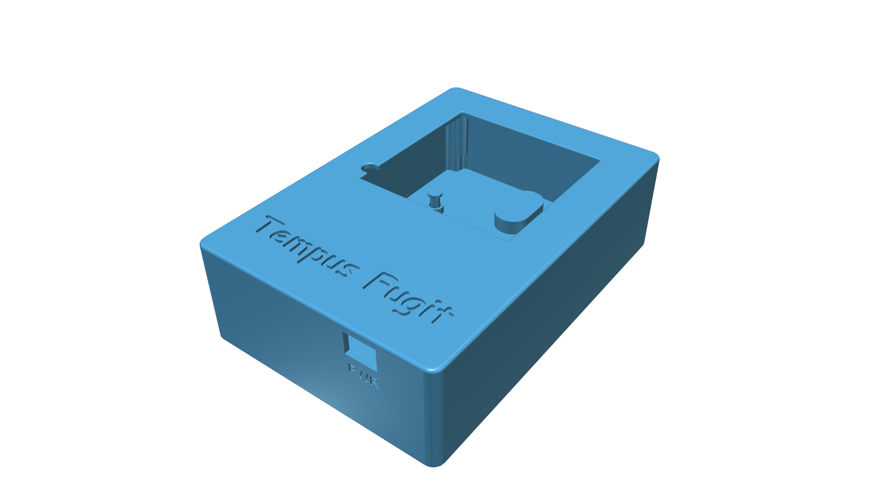

#Tempus Fugit 3D Printed Case

This is my first attempt at a case for my [Tempus Fugit Word Clock](https://meanderingpi.wordpress.com/tf-wordclock1/) (using a Pi Zero).  This will not be suitable for use with an Arduino/Genunio Nano as the power connector is in a different location.  The case is designed to be wall mounted.

Please print 1 each of the following:

- `TF Case - Front.stl`
- `TF Case - Back.stl`
- `TF Case - Buttons.stl`

The case was designed in Autodesk 123D Design - the original design files are included.

Resolution/layer height is 0.2mm.  This was designed to be printed on a FlashForge Creator Pro with a 0.4mm nozzle.

This can also be found on [Thingiverse here](http://www.thingiverse.com/thing:1636905)!

